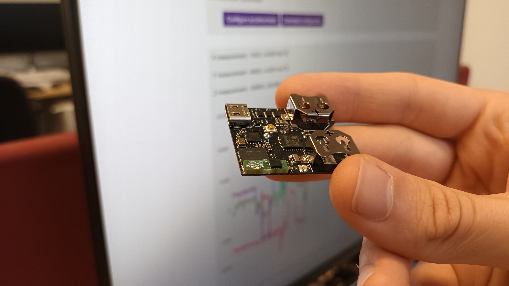
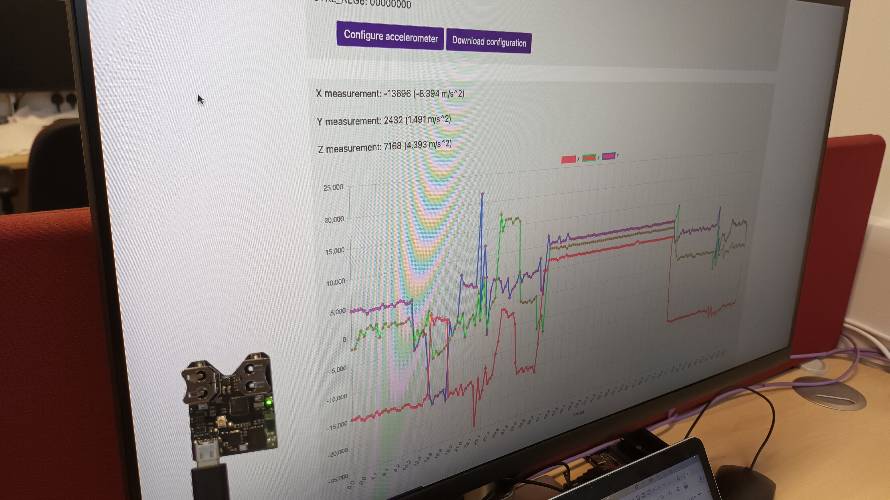

# snappergps-accelerometer-daughterboard

*Author: Jonas Beuchert*

Accelerometer daughterboard for a basic SnapperGPS receiver.

## Table of contents

* [Files](#files)
* [Manufacturing](#manufacturing)
* [Components](#components)
* [Assembly](#assembly)
* [Flashing](#flashing)
* [Usage](#usage)
* [Acknowledgements](#acknowledgements)

## Files

* `accelerometer-daughterboard.brd`: PCB layout file for the daughterboard. Created with Autodesk Eagle.
* `accelerometer-daughterboard`: Schematic file for the daughterboard. Created with Autodesk Eagle.
* `CAMOutputs`: Gerber files and drill file for manufacturing the daughterboard.

## Manufacturing

* Get some PCBs manufactured by a PCB manufacturer of your choice.
(I used [Aisler](https://aisler.net/) or [PCBWay](https://www.pcbway.com/) in the past.)
For this, upload the `.brd` file or the `CAMOutputs` folder to the manufacturer's website.
Choose a two-layered PCB with size 3.74 mm x 11.94 mm.

* If you want, you can also let the manufacturer assemble the board(s) for you.

## Components

* 2x 10 kOhm resistor (footprint 0603), e.g., [RK73H1JTTD1002F](https://octopart.com/rk73h1jttd1002f-koa+speer-2166376).
* 1x [LIS3DH](https://www.st.com/en/mems-and-sensors/lis3dh.html) 3-axis MEMS accelerometer.

## Assembly

* Solder the two resistors and the accelerometer on the daughterboard.
Ensure that the pin-1 dot on the accelerometer is aligned with the dot on the PCB.
I recommend solder paste and a hot plate (or hot air gun) for soldering.

* Solder the assembled daughterboard on a basic SnapperGPS receiver.
The five pads on the back of the daughterboard should connect to the five pads on the SnapperGPS receiver.
The pads labeled `VDD` shall align.

## Flashing

* Download the `SnapperGPS-Accelerometer` firmware from [GitHub](https://github.com/SnapperGPS/snappergps-firmware/releases).
* Go to [https://snappergps.info/flash](https://snappergps.info/flash).
* Connect the SnapperGPS receiver to your computer via USB.
* Pair the SnapperGPS receiver.
* Select the `SnapperGPS-Accelerometer` firmware file.
* Flash the firmware.

## Usage

Find instructions in [the firmware repository](https://github.com/SnapperGPS/snappergps-firmware/blob/main/firmware_versions/snapper-accelerometer/README.md).

|   | 
|:--:| 
| *Figures 1 & 2: SnapperGPS V2.0.0 with accelerometer daughterboard.* |

## Acknowledgements

This SnapperGPS daughter-board was developed by
[Jonas Beuchert](https://users.ox.ac.uk/~kell5462/)
in the Department of Computer Science
of the University of Oxford.

Jonas Beuchert is
funded by the EPSRC Centre for Doctoral Training in
Autonomous Intelligent Machines and Systems
(DFT00350-DF03.01) and develops
SnapperGPS as part of his doctoral studies.
The implementation of SnapperGPS 
was co-funded by an EPSRC IAA Technology Fund
(D4D00010-BL14).

Parts of the design are based on the [Adafruit LIS3DH Triple-Axis Accelerometer (+-2g/4g/8g/16g) PCB](https://github.com/adafruit/Adafruit-LIS3DH-Breakout-PCB), e.g., footprints.
It was designed by Limor Fried/Ladyada for Adafruit Industries.
Find the original readme [here](adafruit-readme.md).

This repository is licensed under a
[Creative Commons Attribution 3.0 International License][cc-by].

[![CC BY 3.0][cc-by-image]][cc-by]

[cc-by]: http://creativecommons.org/licenses/by/3.0/
[cc-by-image]: https://i.creativecommons.org/l/by/3.0/88x31.png
